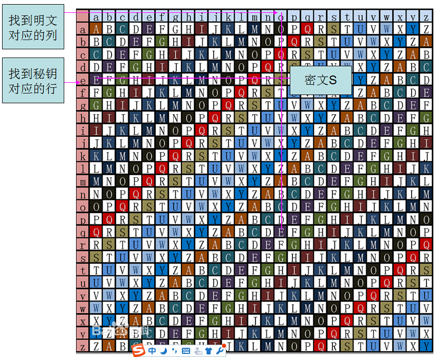
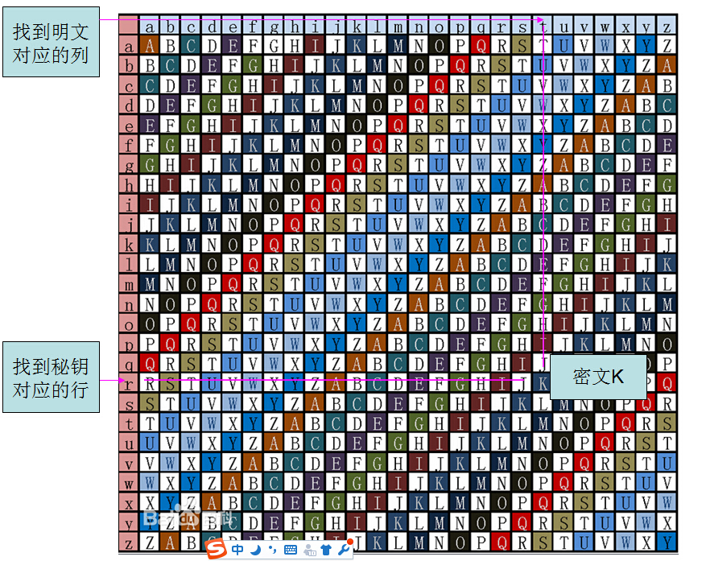

# SGWAEITXASJHJ
欢迎来到最后一步

破译完这一步之后你就能得到最后的信息了

当然，最上面的标题就是我们要解决的最后一步信息233

这里要介绍另一种加密方式叫弗吉尼亚密码，它是一种单表替换密码

这类密码首次引入了密钥的概念

举个简单的例子

比如我们有一条信息

> I LOVE YOU

然后我们用一个密钥去加密，比如这个密钥是这样的

> LGH

那么我们首先把密钥和每一个字母对应上，像这样循环对应

> I LOVE YOU
>
> L GHLG HLG

弗吉尼亚密码不像凯撒密码一样加特定的位数加密，而是根据当前字母对应的密钥字母来决定加多少位

就像上面那样L是第11个字母（A是第0个）

所以I就增加11位

我们数一下

IJKLMNOPQRST第十一个数是T

所以I就被加密成T了

为了避免数数麻烦，我们把偏移结果和密钥的对应关系做成了一个表，所以这种方法叫单表替换法

这个表大概是这样的



或者是这样的



最上面蓝色的一行就是要加密的明文，左边红色的就是密钥了

然后我们只需要找到明文对应的列，然后找到密钥对应的行

行列的交叉点就是加密的结果了

所以解密也很简单

我们只需要把密文与密钥像上面那样排列好

```c++
SGWAEITXASJHJ
LGHLGHLGHLGHL
```

然后先找到密钥对应的行

比如破译第一个字母就是找到密钥L那一行

然后在这一行中找到字母S

然后对着往上找就能找到明文了

好了现在已知这段信息的密钥就是LGH，剩下的就看你的了2333

哦对了如果你现在去你的steam库

你会看到一份礼物

完整版的Life is Strange， 包含后面的章节

Happy Birthday & Have fun.

Yours,

BF